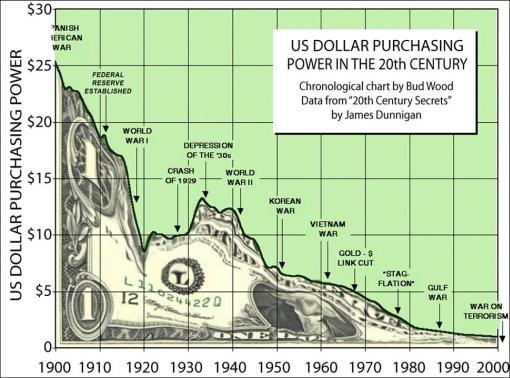
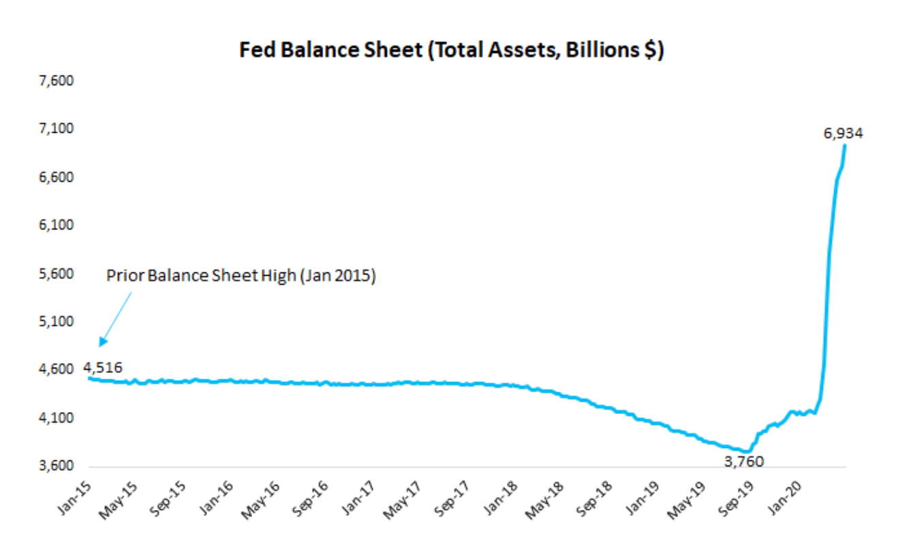
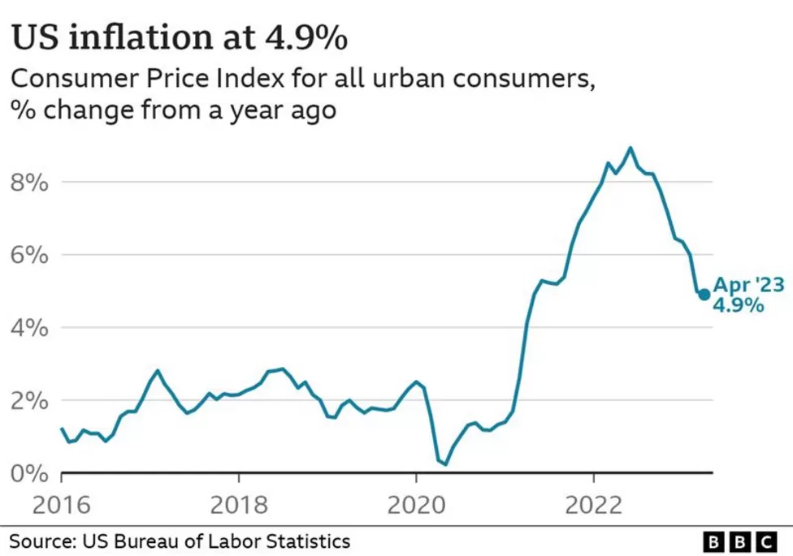

# Dinheiro
## O que é Dinheiro?

O Bitcoin pode ser entendido a partir das três funções essenciais do dinheiro: meio de troca, unidade de valor e reserva de valor.

Eu reconheço que pode parecer um pouco assustador iniciar esse livro com uma discussão potencialmente abstrata, e portanto árdua, mas tem muita gente por aí dizendo que Bitcoin é dinheiro, então é melhor a gente ter certeza se estamos de acordo sobre o que afinal de contas é dinheiro.

O dinheiro pode ser compreendido como o meio pelo qual duas partes concordam em liquidar a troca de um produto, um bem ou um serviço. Desse modo, o dinheiro nos permite trocar nossos recursos ou serviços por uma reserva de valor, independentemente de termos um uso imediato para esse valor armazenado. Essa capacidade permitiu que nossa civilização expandisse e crescesse de maneira muito mais eficiente do que teria acontecido se ainda dependêssemos de práticas como a troca direta, conhecida também por escambo.

Para a pessoa comum, o dinheiro mantém seu valor, pois existem apenas duas maneiras de obtê-lo:

1. Devemos gastar tempo e energia em troca de dinheiro (ou seja, trabalho, esforço, serviços, etc.);
2. Devemos trocar bens ou recursos em troca de dinheiro.

É importante observar que, no segundo ponto acima, para obter esses bens e recursos para trocar, alguém em algum estágio teve que gastar tempo e energia para criá-los. Podemos deduzir, portanto, que devemos gastar tempo e energia para obter dinheiro. Então:

**Dinheiro = Tempo + Energia**

Ao visualizarmos o dinheiro como uma reserva de tempo e energia, podemos entender melhor que o dinheiro é essencialmente uma bateria - um armazenamento de energia que pode ser usado em uma data posterior. Com essa analogia em mente, a evolução do dinheiro, teoricamente, é a busca constante pela bateria mais eficiente para armazenar tempo e energia.

O dinheiro pode também ser definido por um conjunto de características essenciais que o tornam um meio de troca eficiente, uma reserva de valor confiável e uma unidade de medida padrão para avaliar o valor. Essas propriedades são cruciais para que o dinheiro funcione de maneira eficaz em uma sociedade. Vamos mergulhar nas três principais concepções que definem o que é dinheiro "de verdade", ou _hard money_.

### Reserva de valor

Uma função vital do dinheiro é servir como uma reserva de valor, permitindo que as pessoas armazenem o produto de seu trabalho, isto é, de seu tempo e esforço, ao longo do tempo. Uma reserva de valor deve possuir as seguintes características:

* Escassez: significa que a oferta de moeda não muda rapidamente, uma vez que uma mudança rápida na oferta desvalorizaria as unidades existentes.
* Durabilidade: significa que o dinheiro é fácil de guardar ao longo do tempo; não apodrece, enferruja ou quebra facilmente.
* Imutabilidade: As transações realizadas com dinheiro devem ser irreversíveis e confiáveis, minimizando a necessidade de intermediários de confiança.

### Meio de troca

Talvez a função mais imediata do dinheiro, que primeiro vem à mente das pessoas, seja como ele atua como um intermediário nas transações econômicas, permitindo que bens e serviços sejam trocados de maneira eficiente. Um meio de troca deve possuir as seguintes características:

* Portabilidade: O dinheiro deve ser fácil de transportar e usar em transações, independentemente da quantidade dele necessária para a compra.
* Aceitabilidade: O dinheiro deve ser amplamente aceito como forma de pagamento, criando uma rede de confiança entre os participantes econômicos.
* Verificabilidade: significa que ambas as partes, vendedor e comprador do bem ou serviço pode verificar sem muita complicação se o dinheiro é realmente o que parece.

### Unidade de valor
<!-- Não consegui, até hoje, fazer uma boa tradução para "unit of account"; aceito sugestões -->

Uma unidade de valor é uma medida padrão que avalia o valor de diferentes bens e serviços, permitindo comparações diretas. Uma unidade de valor deve possuir as seguintes características:

* Divisibilidade: O dinheiro deve ser divisível em unidades menores sem perder valor, permitindo trocas e compras dos mais diversos valores.
* Fungibilidade: Cada unidade de dinheiro deve ser igual a todas as outras unidades, garantindo intercambialidade sem complicações.

Essas características do dinheiro formam a base que sustenta o funcionamento da economia moderna. Quando analisamos o Bitcoin, é interessante avaliar como ele se encaixa nessas três concepções. Como veremos posteriormente neste livro, o Bitcoin busca abordar essas características de maneira única e inovadora, desafiando as normas monetárias tradicionais e influenciando a maneira como pensamos sobre o dinheiro.

No próximo capítulo, exploraremos algumas etapas-chave na evolução do dinheiro e na transferência de valor.

## Evolução Histórica do Dinheiro

Nesta seção, exploraremos a evolução das formas de dinheiro ao longo da história, culminando na introdução do Bitcoin.

### Escambo

O escambo, também conhecido como troca direta, consiste na troca de bens e serviços por outros bens e serviços diretamente entre as partes interessadas. Ele presupõe que, pelo menos naquela ocasião, os itens trocados têm igual valor.

Atualmente, estamos habituados a trocar valor na forma de moedas e cédulas bancárias. No entanto, essa prática nem sempre foi a norma. O escambo surgiu como uma maneira para os indivíduos de uma comunidade compartilharem e negociarem valor entre si. Além disso, permitia que os membros de uma comunidade se especializassem em uma habilidade e trocassem seus bens e serviços básicos por tudo o que precisavam. Isso contribuiu para elevar a qualidade de vida nas comunidades, distribuindo a carga de trabalho, o que, por fim, levou ao desenvolvimento de habilidades especializadas, já que as pessoas tinham mais tempo para se concentrar no que faziam de melhor.

Por exemplo, para que um plantador de trigo pudesse dedicar mais tempo aprimorando suas técnicas de cultivo e melhorando a qualidade do milho, ele poderia trocar um ou mais milhos com o caçador vizinho, que, em troca, forneceria carne para o agicultor. Alternativamente, uma outra pessoa poderia confeccionar calçados para os habitantes da comunidade em troca de lenha para para zozinhar sua comida.

No entanto, o ponto fraco do escambo residia na ausência de um meio de troca pré-definido pelo qual as pessoas tivessem uso e pudessem guardar seu valor pelo tempo que quisessem ou precisassem. O que acontecia se o plantador de milhos precisasse de carne, mas o caçador não precisasse de mais milhos? E se a confeccionadora de calçados precisasse de mais lenha para cozinhar sua comida, mas os lenhadores já tivessem calçados?

Devido às ineficiências do escambo, as comunidades tendiam a adotar uma mercadoria comummente aceita como intermediária nas trocas, algo onde pudéssemos "estacionar" nosso valor para um momento futuro. Com isso, surgiu o uso de commodities como um meio de troca.

### Dinheiro-commodity

Ao explorarmos o conceito de troca e suas limitações, ficou evidente que era necessário um meio de comércio mais eficiente. Os desafios inerentes à troca, como a necessidade de um "match perfeito" entre as partes envolvidas, levaram ao surgimento de uma solução intermediária: o dinheiro-commodity. Essa inovação revolucionou o comércio ao introduzir um meio de troca pré-definido, lançando as bases para a transição da simples troca para um sistema econômico mais sofisticado.

O dinheiro-commodity envolvia o uso de diversas commodities, frequentemente escassas e universalmente reconhecidas, para facilitar o comércio. Ao contrário da troca, onde encontrar duas partes com desejos complementares era essencial, as commodities como dinheiro eliminaram a necessidade de reciprocidade imediata. Em vez disso, os indivíduos podiam trocar seus bens e serviços por commodities que tinham um valor amplamente reconhecido, permitindo um processo de troca mais eficiente.

A seleção de uma commodity específica para servir como meio de troca trouxe vantagens valiosas para a comunidade. Notavelmente, as commodities tinham a vantagem da durabilidade e estabilidade. Itens como miçangas de vidro, sal e conchas do mar tornaram-se mais do que simples bens físicos; transformaram-se em reservas de valor ao longo do tempo. Por exemplo, o sal, com sua capacidade de ser contado, preservado e transportado, emergiu como um exemplo proeminente de dinheiro-commodity. Sua popularidade derivou de sua utilidade na conservação de carnes e outras aplicações essenciais, tornando-se um ativo valioso dentro do sistema de trocas.

Ibn Battuta, um viajante e geógrafo muçulmano que viveu no século XIV, menciona em um livro chamado _Rihla_ sobre viajantes onde hoje se situa a Somália:

> Um viajante neste país não carrega provisões, nem alimentos simples ou temperos, nem ouro nem prata. Ele não leva nada além de pedaços de sal e ornamentos de vidro, que as pessoas chamam de miçangas, e alguns produtos aromáticos.

No entanto, a escolha de commodities como dinheiro não estava isenta de desafios. Comunidades frequentemente dependiam da escassez de certas commodities em sua região para estabelecer seu valor. À medida que as rotas comerciais se expandiam e as interações globais se tornavam mais frequentes, disparidades na disponibilidade de recursos se tornaram evidentes. Um exemplo ilustrativo é o encontro entre colonizadores europeus e comunidades africanas. Os colonizadores europeus, munidos de tecnologia avançada de produção de vidro, desvalorizaram a moeda local africana — miçangas de vidro — ao introduzir um excedente delas no mercado. Esse excesso desestabilizou o delicado equilíbrio de valor e contribuiu para questões socioeconômicas mais amplas, como o comércio de escravos, afetando, em última instância, a estabilidade da economia africana.

Diante desses desafios, surgiu a busca por commodities com escassez universalmente reconhecida. Essa busca marcou a transição de commodities tradicionais para o surgimento de  metais "monetários" como uma forma avançada de dinheiro-commodity. Metais como o ouro e a prata ganharam destaque devido à sua durabilidade incomparável, escassez inerente e capacidade de manter o poder de compra em diversas regiões e culturas.

A evolução da troca para o dinheiro-commodity representou uma mudança fundamental na história econômica. Isso destacou a capacidade humana de se adaptar e inovar em resposta às deficiências dos sistemas existentes. A introdução do dinheiro-commodity não apenas facilitou o comércio, mas também lançou as bases para o surgimento eventual de sistemas monetários mais sofisticados. A exploração subsequente abordará a utilização do ouro e outros metais preciosos como meios de troca universalmente reconhecidos e as implicações de sua adoção generalizada.

Claro, aqui está o primeiro texto, editado e aprimorado com informações relevantes do segundo texto e com sua coesão e coerência mantidos:

### Metais Monetários

Com a ascensão dos metais monetários, as propriedades-chave do dinheiro "de verdade" começaram a ser satisfeitas pela primeira vez na história, especialmente quando começamos a usar cunhagem.

Uma possível razão para isso é que frequentemente se considera que o valor do dinheiro tende a se aproximar de seu custo de produção. No caso do ouro, isso pode ser compreendido ao examinarmos o custo de produção. Instalações de mineração, estradas e equipamentos requerem um investimento inicial significativo, e o gasto associado à energia necessária para minerar, separar, coletar, refinar e armazenar confere ao ouro (e à prata) um prêmio em relação a outras formas anteriores de dinheiro.

Não devemos esquecer a escassez do ouro na natureza. A escassez é a razão pela qual sal, pedras, conchas e miçangas de vidro não se mostraram formas viáveis de dinheiro, pois estavam sujeitas a diluição devido ao excesso de oferta. Cada uma dessas commodities foi testada e falhou, como no exemplo das miçangas de vidro acima. A escassez não pode ser superestimada em sua importância para um bem monetário eficaz. Além disso, é por isso que o ouro e a prata superaram outros metais, como o aço e o ferro. O ouro e a prata eram significativamente mais difíceis de obter.

Além da desejabilidade do ouro para joalheria e propriedades monetárias, o ouro também tinha usos industriais. Outro motivo fundamental para a ascensão do ouro à supremacia monetária foi que o ouro é um dos elementos mais inertes na tabela periódica, o que significa que não interage com outros elementos. Isso lhe confere uma propriedade única que não é vista em outras commodities, tornando-o extremamente durável.

À medida que a tecnologia avançava, também avançava o uso dos metais monetários. O ouro e a prata podiam ser derretidos, moldados e cunhados em moedas, o que aprimorava sua aceitabilidade, divisibilidade, fungibilidade e intercâmbio. No entanto, essa manipulação do metal na cunhagem foi rapidamente explorada. Um exemplo é o corte ou a raspagem de moedas. Indivíduos e governos cortavamou raspavam porções das moedas para reduzir seu peso de metal precioso, ao mesmo tempo em que tentavam manter seu valor facial original. Eles derretiam esses fragmentos e cunhavam novas moedas, resultando nas primeiras formas conhecidas de inflação monetária (desvalorização).

Para complicar ainda mais o contexto, o mundo começou a se tornar mais global, expandindo o comércio internacional. Embora a globalização possa ter trazido muitos benefícios, ela represntou um desafio para navegadores e outros intermediários, pois o ouro é extremamente volumoso e pesado para transportar e negociar. Com isso, o ouro e a prata começaram a perder popularidade para um meio de troca mais facilmente transacionável e com menor custo de transporte e risco de perda, o papel lastreado em metal, sobre o qual falamos a seguir.

### Papel-moeda lastreado em metais

O papel-moeda lastreado em metal significou uma evolução importante na fungibilidade, divisibilidade e portabilidade do dinheiro.

O comércio global foi bastante influenciado por essa tecnologia, pois as pessoas passaram a poder, ao invés de carregar metais, que são pesados, deixá-los com  intermediários, e em troca receber um recibo de papel que, se amplamente aceito, facilitava sua troca.

Com o armazenamento dos metais preciosos em troca de recibos de papel, vimos a transição de um sistema monetário "auto-custodial" (os indivíduos tinham soberania sobre seu dinheiro, pois o guardavam e gerenciavam pessoalmente) para um sistema monetário "custodial", onde os indivíduos transferiam o armazenamento de sua riqueza para uma entidade, iniciando, assim, a grande centralização do sistema monetário como conhecemos hoje.

Em 1812, a Grã-Bretanha tornou-se o primeiro país a adotar o que é conhecido como padrão-ouro, isto é, o governo britânico prometia que qualquer pessoa poderia trocar seu papel-moeda, isto é, suas libras esterlinas, por ouro, o que ampliou o caminho para a centrlização do sistema monetário por meio da centralização dos estoques de ouro em uma única entidade, o Banco da Inglaterra. Na posição de um poderoso império global, a Grã-Bretanha abriu caminho para a proliferação do papel-moeda lastreado em metal. Países que aderiram ao padrão prata por muito tempo, como Índia e China, viram suas moedas enfraquecerem à medida que a demanda pelo metal caía na América do Norte e na Europa, resultando em consequências econômicas negativas.

As cédulas bancárias tornaram o ouro mais divisível e, assim, o dinheiro mais "sólido" prevaleceu ao longo do tempo. As melhorias nos serviços de comunicação e foram levando aos poucos à abstração do ouro. As pessoas podiam depositar seu ouro nos bancos e receber crédito em papel representando uma promessa de que poderiam restagar aquele ouro. Os bancos, sabendo que nem todos resgatariam seu ouro de uma vez, emitiram mais reivindicações do que o ouro que possuíam, iniciando a prática da reserva fracionária bancária. O sistema bancário então se consolidou em bancos centrais ao longo do tempo em vários países, com cédulas nacionais representando uma reivindicação a uma certa quantidade de ouro, surgindo assim a moeda fiduciária, de que trataremos a seguir.

### Moeda fiduciária: uma questão de fé

A palavra "fiduciária" vem do latim "fiat", que significa "que assim seja", e é usada no sentido de uma ordem, decreto ou resolução. Originalmente, essa ordem seria dada por um monarca, mas hoje, no caso do dinheiro, é dada pelo estado.

Ter uma moeda fiduciária significa, portanto, que o dinheiro não é mais selecionado pela sociedade ou respaldado por algo de valor, como o ouro. Em vez disso, seu suposto valor é dado por decreto: o dinheiro tem valor porque o estado diz que tem.

O fim da moeda em papel lastreada em metal começou no final da Segunda Guerra Mundial. Com os Estados Unidos exercendo um papel imperialista global, líderes globais se reuniram em Bretton Woods, no estado de New Hampshire nos Estados Unidos, e determinaram que os Estados Unidos ligariam seu dólar ao ouro e o resto do mundo ligaria sua moeda ao dólar. Isso significava que a maior parte do ouro do mundo fluía para os Estados Unidos para ser guardado, esgotando muitos países de suas reservas domésticas de ouro.

Avançando para o final dos anos 60 e início dos anos 70, os Estados Unidos, sentindo-se restritos com o lastro de ouro, começaram a expandir sua oferta monetária para financiar a guerra no Vietnã. A França não ficou satisfeita com isso e exigiu seu ouro de volta. Isso causou uma corrida pelo ouro e, como os Estados Unidos haviam impresso significativamente mais dólares do que o ouro disponível, eles abandonaram rapidamente essa ligação por completo. Os Estados Unidos não cumpriram sua obrigação de permitir que indivíduos e países trocassem seus dólares por ouro. Esse evento é conhecido como o Choque de Nixon e é um dos eventos-chave em nossa história monetária e a partir desse dia vimos a proliferação de moedas fiduciárias - uma moeda respaldada apenas por dívida e pela fé da sociedade no governo.

A moeda fiduciária e a dívida soberana (isto é, governamental) formam a base do sistema monetário atual e dá aos governos e bancos um controle imenso, pois eles têm a capacidade de expandir e contrair livremente a oferta monetária conforme desejarem[^1].

[^1]: Bancos centrais ao redor do mundo ainda mantêm ouro em seus cofres e muitos deles ainda compram mais ouro a cada ano como parte de suas reservas cambiais. Como o ouro é ainda hoje classificado como um ativo de primeira categoria no sistema bancário global, embora as moedas emitidas pelos governos não sejam mais lastreadas no ouro (a Suiça foi o último país a abandonar o lastreamento de sua moeda no ouro em 1999), ele continua sendo uma peça importante do sistema monetário global como um ativo de reserva.

Mas moedas fiduciárias tem em sua estratégia uma característica muito relevante: elas são inflacionárias por definição e portanto incapazes de armazenar valor ao longo do tempo, já que podem ser impressas por decreto e não com base na criação de valor.

Vejamos, por exemplo, duas informações sobre o dólar, considerada pelo mercaod financeiro, por razões que não discutiremos aqui, a moeda mais segura do mundo. Primeiro, vejamos, no gráfico abaixo, como o dólar perdeu seu valor de compra ao longo do tempo:

Fonte: [Seeking Alpha](https://seekingalpha.com/article/137051-the-dollars-20th-century-decline).

O que corroeu e continua corroendo o dólar e todas as outras moedas fiduciárias ao longo do tempo é sua inerente característica inflacionária. Vamos discutir melhor esse aspecto na terceira parte deste livro quando falarmos da geopolítica do Bitcoin. Por hora, apenas para exemplificar melhor o poder corrosivo da impressãos em lastro de moeda em papel, vejamos o que ocorreu durante a pandemia de Covid 19, quando o Federal Reserve (FED), o Banco Central dos Estados Unidos, imprimiu mais dólares do que anteriormente em toda a sua história:

Fonte: [Virtuse](https://www.virtuse.com/whats-the-end-game-of-all-this-money-printing-2/).

Como conequência, a inflação nos EUA subiu de quase zero em 2020 para 9,1% em junho de 2022, "forçando" o FED a arrochar a economia aumentando a taxa de juros, método bastante conhecido de nós brasileiros.

.

Minha itenção em utilizar a economia estadunidense como exemplo é pelo fato de, primeiro, ser a maior economia do mundo; e, além disso, de ser considerada a mais segura. E ainda assim, vemos que ela não resiste aos problemas inerente de uma economia fiduciária. Outro exemplo disso são as quebras de bancos, invariavelmente salvos pelos governos. Foi numa dessas ocosiões que uma pessoa ou grupo de pessoas que atende pelo pseudônimo de Satashi Nakamoto publicou o que talvez possa vir a ser o próximo passo na evolução histórica do dinheiro, o Bitcoin.

Satoshi Nakamoto inseriu no Bloco Gênesis, isto é, no primeiro bloco da blockchain chamda por ele de Bitcoin[^2], a seguinte mensagem: "_The Times 03/Jan/2009 Chancellor on brink of second bailout for banks_."

[^2]: Na próxima seção deste livro trataremos dos aspectos técnicos com mais detalhes e essa terminologia será melhor explicada.

Embora Nakamoto nunca tenha comentado sobre o significado desse texto, a maioria acredita que ele sirva como uma declaração de missão para o próprio Bitcoin.

O texto é um título de um artigo na edição de 3 de janeiro de 2009 do The \[London\] Times sobre a falha do governo britânico em estimular a economia após a crise financeira de 2007-2008 e a constante necessidade de governos precisarem evitar a falência de instituições financeiras "grandes demais para falir". A maioria dos bitcoiners (ou bitcoinheiros, num português mais corrente) acredita que a referência de Nakamoto ao artigo no código do Bloco Gênesis foi uma dica de como o Bitcoin é diferente dos grandes bancos de investimento que precisaram de resgates governamentais em 2008. Será?

### Mas e o Bitcoin, hein?

A ideia de se lançar uma "moeda digital" não nasceu com o Bitcoin, antes do lançamento do bitcoin, existiram várias tentativas de criar dinheiro digital[^3], ele foi "apenas" o único bem-sucedido. A tecnologia disponível no século 20 fez com que Cypherpunks, um grupo de indivíduos focados na privacidade por meio da tecnologia, em busca de escassez digital, não subservientes a nenhuma entidade central, embarcaram em uma missão para descobrir uma versão digital melhorada dos metais monetários. Eles estavam procurando por **ouro digital**. Algo que pudesse armazenar valor e oferecer durabilidade, mas que pudesse ser usado para transações digitais e não fosse controlado por um poder cental.

[^3]: Um resumo da história do dinheiro digital anteriormente ao Bitcoin pode ser encontrado [neste artigo](https://en.wikipedia.org/wiki/History_of_bitcoin#Background}) da Wikipedia.

Mas foi em 2009 que Satoshi Nakamoto divulgou a primeira moeda digital que poderia satisfazer a maioria das propriedades que compõem o dinheiro de qualidade. A invenção de Nakamoto era digitalmente programável e operava por consenso de grupo.devolvendo assim o poder à sociedade. Além disso o Bitcoin seria um ativo verdadeiramente escasso, à prova de adulteração, com um suprimento limitado e publicamente visível que ninguém poderia alterar. Portanto, é impossível diluir ou adulterar da mesma forma que governos fazem com suas moedas fiduciárias.

O Bitcoin é um instrumento de custódia individual e digital, o que significa que não há necessidade de terceiros ​​para guardar o seu dinheiro ou de intermediários para transacioná-lo. Os participantes na rede impõem as regras por consenso - a política monetária é controlada por aqueles que participam do ecossistema, isto é, ele não depende de cofres de bancos comerciais ou de bancos centrais. Fora do controle de governos e bancos centrais, o Bitcoin formou um sistema monetário alternativo e manipulável. Desde 2009, o Bitcoin não enfrentou grandes falhas técnicas, hacks ou problemas, e sua aceitação como um bem monetário continua crescendo.

Portanto, aparentemente o Bitcoin tem a maioria das característica que podem fazer dele um dinheiro de qualidade, possívelmente o melhor dinheiro que já existiu, quando comparamos as características que as sociedades ao longo da história valorizaram para transformar algo em dinheiro, como podemos verificar na tabela abaixo.

Property	Barter	Commodities	Monetary Metals	Metal-Backed Paper	Fiat Currency	Bitcoin	CBDCs
Store of Value							
Scarcity	Poor	Good	Excellent	Great	Poor	Excellent	Poor
Durability	Poor	Good	Excellent	Good	Good	Excellent	Average
Immutability	Great	Great	Great	Average	Average	Excellent	Poor
Medium of Exchange							
Portability	Poor	Average	Good	Great	Great	Excellent	Great
Acceptability	Poor	Great	Great	Great	Excellent	Average	Average
Unit of Account							
Divisibility	Poor	Good	Good	Great	Great	Excellent	Excellent
Fungibility	Poor	Good	Good	Great	Great	Excellent	Average
Overall Rating	Poor	Good	Great	Great	Good	Excellent	Average

